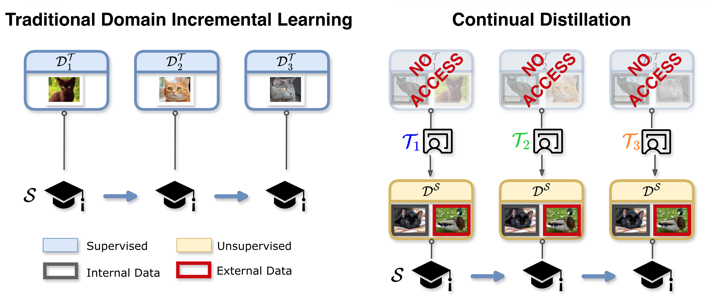

# Continual Distillation of Teachers from Different Domains

This repository is the **official implementation** of the paper **"Continual Distillation of Teachers from Different Domains"**, accepted at **CVPR 2026**.

It contains the training code, method implementations, dataset loaders, checkpoint resolution logic, and experiment structure used for the paper.



The core idea is simple:

1. Start with a student model.
2. Load a sequence of teacher checkpoints, each representing a new domain.
3. Train the student incrementally as the teacher domain changes.
4. Evaluate the student across all domains after each training step.

This repository is intentionally narrow. It has:

- one main training entrypoint: `main.py`
- a small set of maintained methods in `src/methods/`
- shared dataset, checkpoint, and training helpers in `src/utils/`
- JSON config files for experiment defaults and method-specific settings
- teacher checkpoints stored under `checkpoints/teachers/`

## Paper

- Title: **Continual Distillation of Teachers from Different Domains**
- Venue: **CVPR 2026**
- arXiv: **Coming soon**. A public preprint link will be added here once available.


## Citation

The BibTeX citation is not public yet. It will be added here once the paper metadata and public preprint are finalized.

```bibtex
% BibTeX citation coming soon.
% It will be added here after the public release of the paper / arXiv version.
```

## Quick Start

### 1. Create and activate a Python environment

```bash
python -m venv .venv
source .venv/bin/activate
python -m pip install --upgrade pip
```

### 2. Install dependencies

Install PyTorch and torchvision first, using the official instructions that match your OS, Python version, and CUDA setup.

Then install the repo dependencies:

```bash
pip install -r requirements.txt
```

The maintained codepath is vision-only.

If you do not want online experiment logging, disable W&B:

```bash
export WANDB_MODE=disabled
```


### 3. Pretrain teachers or verify that teacher checkpoints already exist

Student training expects teacher checkpoints under `checkpoints/teachers/`.

If you do not already have them, generate them first:

```bash
python scripts/pretrain/cifar20_teachers.py
python scripts/pretrain/digits_teachers.py
python scripts/pretrain/domainnet_teachers.py
```

If you already have the checkpoints, place them under `checkpoints/teachers/` with the expected dataset-specific folder names.


### 4. Run the fastest syntax check

```bash
python -m compileall main.py src configs
```


### 5. Run a small experiment

KL distillation on CIFAR-20:

```bash
python main.py \
  --method kl_divergence \
  --dataset cifar20 \
  --domains-teacher 0 \
  --domains-data 0 4 \
  --config-path configs/default.json
```

DKD on a mixed CIFAR-20 + MNIST run:

```bash
python main.py \
  --method dkd \
  --dataset mixed_cifar \
  --aux-dataset mnist
```


## Supported Methods

Only these methods are part of the maintained path.

| Method | Legacy Alias | What It Does |
| --- | --- | --- |
| `kl_divergence` | `baseline`, `kl` | Plain teacher-student KL distillation |
| `dkd` | `dkd` | Decoupled knowledge distillation |
| `mds` | `medium` | Selects middle-entropy samples before training |
| `ls` | `stand` | Standardized-logit distillation with pure KD on standardized logits |
| `self_distillation` | `checkpoint`, `self-distillation` | Distills from the current teacher and the previous student on all samples |
| `se2d` | `checkpoint_ours`, `checkpoint-ours` | Distills from the current teacher and the previous student on retained domains |

Method aliases are accepted at the CLI, but the codebase and documentation use the canonical names above.

## Repository Layout

```text
continual_distillation/
├── main.py                         # main training entrypoint
├── README.md                      # repository overview and usage
├── requirements.txt               # base Python dependencies
├── configs/
│   ├── default.json               # run-level defaults
│   ├── parser.py                  # CLI definition
│   └── methods/                   # method-specific JSON overrides
├── src/
│   ├── methods/                   # method wrappers and registry
│   ├── models/                    # student/teacher model factories
│   └── utils/                     # data loading, checkpoints, evaluation, training loops
├── scripts/
│   └── pretrain/                  # teacher pretraining scripts
├── checkpoints/
│   └── teachers/                  # teacher checkpoints used by student training
├── data/                          # datasets and DomainNet split files
├── docs/
│   └── assets/                    # README figures such as the overview image
└── outputs/                       # generated student checkpoints and evaluation tables
```

The most important files are:

- `main.py`: run orchestration
- `configs/default.json`: run defaults
- `configs/methods/*.json`: method-specific settings
- `src/utils/data_utils.py`: dataset loading
- `src/utils/train_functions.py`: training loops
- `src/utils/checkpoints.py`: teacher checkpoint resolution


## Datasets

The maintained dataset modes are:

- `cifar20`
- `domainnet`
- `digits`
- `mixed_cifar`
- `mixed_domainnet`

Domain IDs:

- CIFAR-20: `0..4`
- DomainNet: `0..5` = `clipart`, `infograph`, `painting`, `quickdraw`, `real`, `sketch`
- digits: `0..5` = `MNIST`, `SVHN`, `MNIST-M`, `USPS`, `KMNIST`, `Fashion-MNIST`

The mixed modes are simple concatenations:

- `mixed_cifar` = CIFAR-20 domain `0` + auxiliary dataset
- `mixed_domainnet` = DomainNet domain `0` + auxiliary dataset


## Checkpoints and Configs

Teacher checkpoints live under `checkpoints/teachers/` and are resolved by dataset:

- CIFAR-20 and `mixed_cifar`: `checkpoints/teachers/cifar20/domain_<teacher_id>/best_model.pth`
- DomainNet and `mixed_domainnet`: `checkpoints/teachers/domainnet/pair_<teacher_id>/best_model.pth`
- digits: aliases such as `0_1 -> mnist_svhn`, `0_2 -> mnist_mnist-m`

Configuration precedence is:

1. parser defaults in `configs/parser.py`
2. run config, usually `configs/default.json`
3. explicit CLI flags
4. method config from `configs/methods/<method>.json`

`domains_data` controls which domains are loaded into the dataloader. The teacher sequence is derived separately from the dataset and truncated before the first non-zero external domain, preserving the historical experiment behavior.


## Pretraining

Teacher pretraining scripts live under `scripts/pretrain/`:

- `python scripts/pretrain/cifar20_teachers.py`
- `python scripts/pretrain/digits_teachers.py`
- `python scripts/pretrain/domainnet_teachers.py`

These populate the standard non-foundation teacher tree under `checkpoints/teachers/`.


## Troubleshooting

- If `timm` tries to download pretrained weights, make sure the machine has network access or pre-cache the weights locally.
- If you do not want online logging, use `export WANDB_MODE=disabled` or `export WANDB_MODE=offline`.
- If dataloader workers fail in a restricted environment, run outside the sandbox or reduce worker counts in `src/utils/data_utils.py` and `src/utils/helpers.py`.
- If a teacher checkpoint is not found, check the dataset name, `domains_teacher`, and the implied task/domain index.
